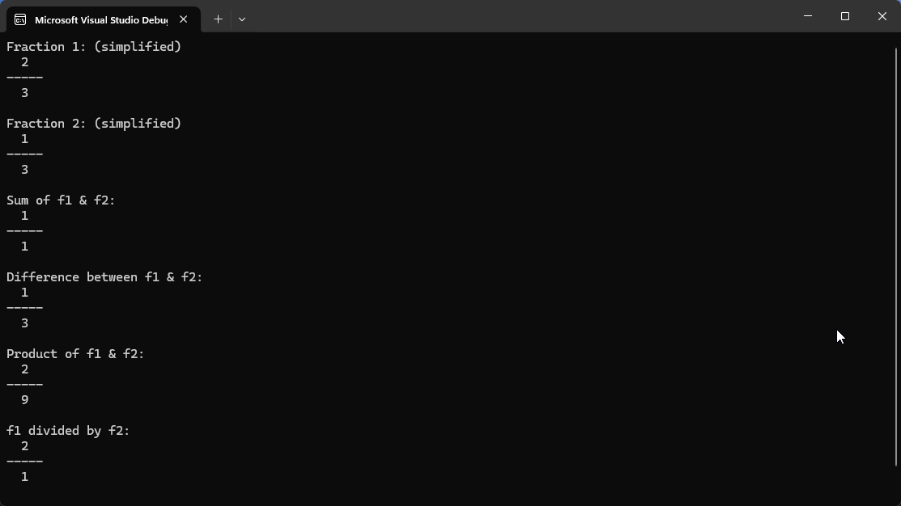

# Fraction Class - C++ Implementation

A simple C++ program with a `Fraction` class that demonstrates operator overloading for arithmetic operations on fractions.

## Features
- **Operator Overloading**: `+`, `-`, `*`, `/`
- **Fraction Simplification**: Reduces fractions to the simplest form
- **Stream Insertion**: Overloaded `<<` for easy output

## ⚙️ How to Run

1. Open the `.sln` (Visual Studio Solution) file in **Microsoft Visual Studio**
2. Press `Ctrl + F5` or click **Run** to execute the program

## Demo Output

